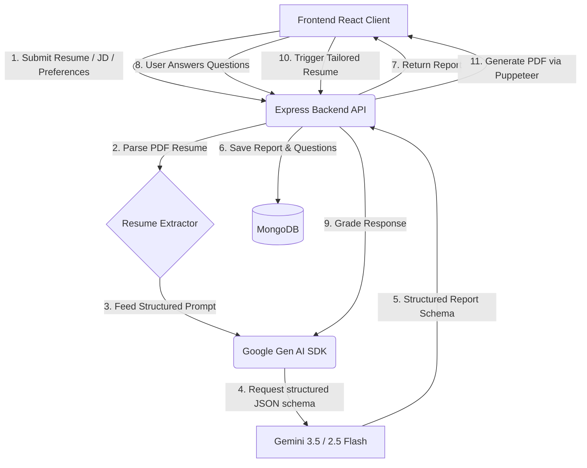

Interview.AI - Complete AI-Powered Mock Interview & Career Preparation Platform
Welcome to **Interview.AI**, an intelligent, full-stack application designed to help job seekers stand out and ace their tech interviews. By analyzing job descriptions and user profiles (resumes/descriptions) using Gemini 2.5 and Gemini 3 Flash models, the platform builds personalized prep plans, generates mock interviews, grades responses in real time, and custom-tailors ATS-friendly resumes.
### 🌐 Live Deployment
* **Live Link**: [https://interview-ai-frontend-hs3i.onrender.com](https://interview-ai-frontend-hs3i.onrender.com)
* **Backend API Base**: Hosted on Render
---
## ✨ Key Features
- **🎯 Tailored Interview Plans**: Compares your resume or self-description against a target job description. The AI generates a customized preparation timeline, highlights key skill gaps, and matches your profile against target company settings.
- **⚙️ Deep Interview Parameter Controls**:
  - **Difficulty Levels**: `Entry`, `Mid`, `Senior`, `Lead`
  - **Interview Tones**: `Standard`, `Friendly`, `Stress` (high-pressure/analytical questions)
  - **Company Types**: `FAANG / Big Tech`, `Startup`, `Enterprise`
- **💬 Interactive Mock Interview Room**: Experience a simulated live interview context. The platform renders both technical and behavioral questions tailored to your chosen tone and level.
- **📊 Real-time Grading & Feedback**: Input your answers to see immediate grading (0-100 score), structured feedback pointing out strengths/weaknesses, and concrete suggestions on how to improve.
- **📄 ATS-Optimized Resume Tailoring**: Generates a custom-tailored, professional, ATS-compliant resume in PDF format (using a serverless Puppeteer implementation) specifically tuned to match your target job description.
- **🤖 AI Career Assistant**: A dedicated companion chatbot trained as a world-class tech recruiter and career coach. Can do live Q&A, explain concepts, build personalized learning roadmaps, or do single-question mock sessions.
---
## 🛠️ Tech Stack
### Frontend
- **Framework**: React 19 (Vite)
- **Styling**: SCSS / Sass
- **Animations**: GSAP (GreenSock Animation Platform) + `@gsap/react`
- **Routing**: React Router 7
- **HTTP Client**: Axios
### Backend
- **Runtime**: Node.js & Express.js
- **Database**: MongoDB (Mongoose Object Modeling)
- **AI SDK**: `@google/genai` (Official Google Gen AI SDK)
- **Models**: `gemini-2.5-flash`, `gemini-3-flash-preview`
- **Document Generation**: Puppeteer (HTML-to-PDF Conversion)
- **Security & Utilities**: JWT, bcryptjs, Cookie-Parser, Multer (file parsing), PDF-Parse (resume extraction), Zod (schema validations)
---
## 📐 System Architecture
Below is a simple visual flow of how data flows through the **Interview.AI** ecosystem:

---
## 🚀 Setup and Installation
Follow these steps to run the project locally.
### Prerequisites
- [Node.js](https://nodejs.org/) (v18+ recommended)
- [MongoDB Atlas](https://www.mongodb.com/cloud/atlas) or a local MongoDB database instance.
- A **Google Gemini API Key** (obtainable from Google AI Studio).
### 1. Clone the Repository
```bash
git clone https://github.com/siddhiavhad27/week7-8project.git
cd week7-8project
```
### 2. Backend Configuration
Navigate to the `Backend` directory and configure the environment variables:
```bash
cd Backend
npm install
```
Create a `.env` file in the `Backend` folder:
```env
PORT=3000
MONGO_URI=your_mongodb_connection_string
JWT_SECRET=your_jwt_secret_key
GOOGLE_GENAI_API_KEY=your_gemini_api_key
FRONTEND_URL=http://localhost:5173
```
To run the Backend locally in development mode:
```bash
npm run dev
```
### 3. Frontend Configuration
Navigate to the `Frontend` directory:
```bash
cd ../Frontend
npm install
```
Create a `.env` or `.env.local` file in the `Frontend` folder:
```env
VITE_API_BASE_URL=http://localhost:3000
```
To run the Frontend locally:
```bash
npm run dev
```
Open your browser and navigate to `http://localhost:5173`.
---
## 📡 API Endpoints Overview
### Authentication Routes (`/api/auth`)
|
 Method 
|
 Endpoint 
|
 Description 
|
|
:---
|
:---
|
:---
|
|
**
POST
**
|
`/api/auth/register`
|
 Register a new account 
|
|
**
POST
**
|
`/api/auth/login`
|
 Login user and set secure HTTP-only cookies 
|
|
**
GET
**
|
`/api/auth/logout`
|
 Clear auth cookies and logout 
|
|
**
GET
**
|
`/api/auth/get-me`
|
 Retrieve authenticated user profile 
|
### Interview Routes (`/api/interview`)
|
 Method 
|
 Endpoint 
|
 Description 
|
|
:---
|
:---
|
:---
|
|
**
POST
**
|
`/api/interview/`
|
 Generate dynamic plan and questions (accepts multipart form-data for resume) 
|
|
**
GET
**
|
`/api/interview/`
|
 Fetch all previously generated plans for the logged-in user 
|
|
**
GET
**
|
`/api/interview/report/:id`
|
 Fetch specific plan and graded feedback by ID 
|
|
**
POST
**
|
`/api/interview/report/:id/toggle-task`
|
 Toggle completion status of preparation plan checklist items 
|
|
**
POST
**
|
`/api/interview/grade-answer`
|
 Grade user response to a mock question 
|
|
**
POST
**
|
`/api/interview/resume/pdf/:id`
|
 Generate tailored resume PDF matching job description 
|
|
**
POST
**
|
`/api/interview/assistant/chat`
|
 Send a message to the AI Career Assistant Chatbot 
|
---
## ☁️ Deployment Instructions (Render)
### Backend Deployment
1. Create a **Web Service** on Render.
2. Select your repository.
3. Configure the environment variables in Render's dashboard under **Environment Settings** matching your `.env` keys.
4. Set the build command to `npm install` and the start command to `node server.js` (pointing to your server entry point).
### Frontend Deployment
1. Create a **Static Site** on Render.
2. Connect your repo and set the base directory to `Frontend`.
3. Set the build command to `npm run build` and publish directory to `dist`.
4. Add the environment variable `VITE_API_BASE_URL` pointing to your deployed Backend Web Service URL.
5. In Render redirect/rewrite settings, configure:
   - **Source**: `/*`
   - **Destination**: `/index.html`
   - **Action**: Rewrite (to allow SPA routing to work correctly).
